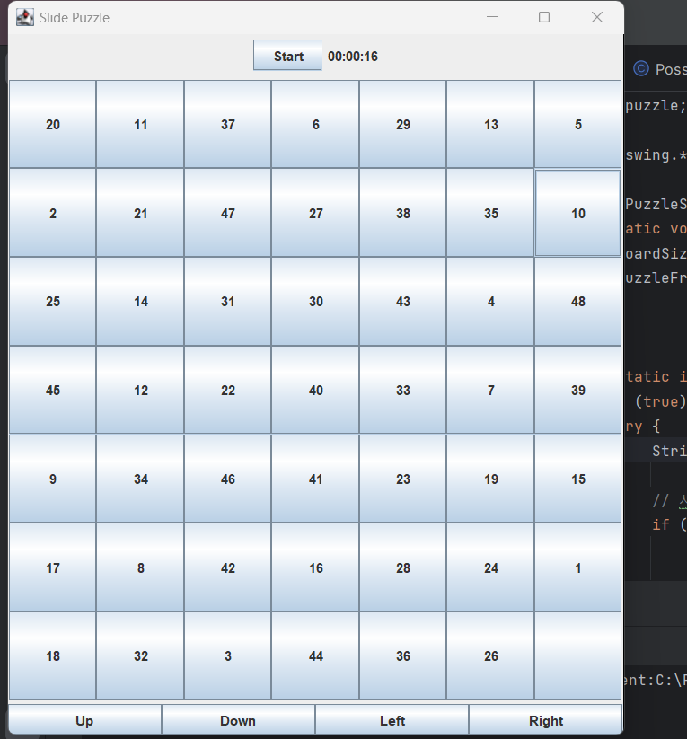

# [Program Methodology]
## 한양대학교 ERICA 소프트웨어융합대학 인공지능학과

### 슬라이드 퍼즐게임 확장내용 발표 [팀명: 윤이김]
[윤병선:발표 담당, 김도현:코딩 담당, 윤태원:코딩 및 마크다운 작성 담당]

-저희는 확장할 게임으로 슬라이드 퍼즐게임을 선택했습니다. 생각나는 확장내용이 많고 구현하기도 흥미로워보였기 때문입니다.

#### 개선사항 1. 슬라이드 퍼즐 보드의 크기를 조정하기

* `JOptionPane` 기능을 사용하여 퍼즐 보드의 크기를 입력받고 이에 따른 퍼즐 보드를 반환합니다. 시중에서 파는 4x4 5x5 뿐만 아니라 흔히 보지 못했을 6x6 이상의 퍼즐 보드도 구현할 수 있습니다. 최대 9x9까지 체험하실 수 있습니다.
  

^크기 생성을 묻는 창

#### 개선사항 2. 슬라이드 퍼즐 가해성을 판단하는 메소드 구현 및, 해결 불가능한 경우를 제거

* 저희가 슬라이드 퍼즐을 자바로 구현하면서 모두가 한 번씩쯤은 디버깅을 열심히 하셨을텐데요.
  
* 저희가 만들었던 4x4 퍼즐보드에서 14와 15의 위치만 바뀐 경우 절대로 풀 수 없어 디버깅을 하는데에 곤란하셨을 겁니다.
  
* 개선사항1에서 구현한 퍼즐보드의 크기가 커질 수록 드는 시간이 많이 드는 데, 푸는 것이 불가능한 퍼즐의 경우 디버깅에 있어 치명적이었습니다.
  
* 그래서 저희는 풀 수 있는 퍼즐 보드만 만들 수는 없을까 생각했습니다.
  

* 처음에는 슬라이드 퍼즐을 푸는 알고리즘 중 `A*`라는 휴리스틱 알고리즘 사용을 고민하였으나, `Java`에서 이를 구현하기에는 아직은 어렵다고 판단하고, `Inversion`이라는 개념을 사용하여 구현하였습니다.
  
* 참고한 자료는 다음과와 같습니다. <a href="https://natejin.tistory.com/m/22"> 참고한 티스토리 블로그</a>

#### 개선사항 3. 슬라이드 퍼즐 버튼을 한 번에 미는 메소드를 버튼으로 구현하기

* 저희가 개발하는 도중에 교수님께서 2048을 구현해보라는 말씀에서 착안한 개선사항입니다.
  
* 저희는 개선사항1에서 구현했던 퍼즐 보드의 크기가 커지면 커질수록 버튼을 눌러야하는 횟수가 많이 증가하며 이를 완화하기 위해 일괄 버튼 밀기 기능을 구현하고자 하였습니다.
  
* 아래로 `Up` `Down` `Left` `Right` 버튼을 구현하여 2048처럼 빈 공간에 퍼즐들을 한 번에 이동시킬 수 있습니다.
  

^`Right`을 사용하여 버튼 밀기

^`Up`을 사용하여 버튼 밀기

^`Left`을 사용하여 버튼 밀기

* 알고리즘은 대표적으로 버튼 하나만 살펴보자면 다음과 같습니다.

-----------------------------------------------------------------------------

*이로서 저희 [윤이김] 팀이 슬라이드 퍼즐 개선사항을 모두 발표하였습니다. 

*이 프로젝트를 하며, 저희가 실습 시간에 했던 슬라이드 퍼즐에 대해 더욱 심도 있게 알아볼 수 있었다고 생각합니다.

*또 팀원들과 협력하며 프로젝트를 하는 것에 있어, 경험을 더욱 쌓을 수 있었다고 생각합니다.

*이상으로 발표를 마치겠습니다.
